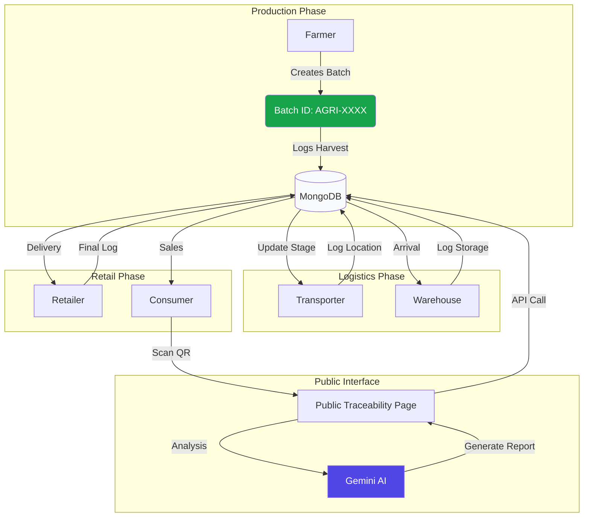

# 🌾 AgriTrace: End-to-End Supply Chain Transparency

**AgriTrace** is a state-of-the-art, production-ready traceability platform for the agricultural industry. By combining modern web technologies with AI-driven insights, AgriTrace ensures that every step of a product's journey—from harvest to the consumer's table—is documented, verified, and transparent.


---

## ✨ Key Features

### 🛡️ Security & Trust
- **OTP-Based Verification**: Secure 6-digit One-Time Password system for password recovery via **Resend**.
- **Immutable Logs**: A sequential, append-only logging system for every supply chain stage.
- **Role-Based Access (RBAC)**: Dedicated dashboards for Farmers, Transporters, Warehouses, Distributors, and Retailers.
- **Hardened Backend**: Protection against NoSQL injection, XSS, and Brute-force attacks (Helmet + Rate Limiting).

### 🤖 AI-Powered Intelligence
- **Freshness Scoring**: Real-time analysis of batch logs to determine the estimated freshness of produce.
- **Risk Detection**: Automated scanning for delays or anomalies in the supply chain using **Gemini 1.5 Flash**.
- **Public Traceability**: Consumers can scan QR codes to see a beautiful, AI-summarized history of their food.

### 🎨 Premium UI/UX
- **Tailwind v4 Styling**: Modern, fluid design system with custom brand tokens.
- **Framer Motion**: Smooth page transitions and interactive micro-animations.
- **Real-Time Dashboards**: Instant statistics on batch status and supply chain velocity.

---

## 🔄 Supply Chain Workflow



---

## 👥 Stakeholder Accounts (Demo)

| Role | Name | Email | Password |
| :--- | :--- | :--- | :--- |
| **Farmer** | Frank Farmer | `frank_farmer@gmail.com` | `frankfarmer` |
| **Transporter** | Tracey Transporter | `tracey_transporter@gmail.com` | `traceytransporter` |
| **Warehouse** | Walter Warehouse | `walter_warehouse@gmail.com` | `walterwarehouse` |
| **Distributor** | Diana Distributor | `diana_distributor@gmail.com` | `dianadistributor` |
| **Retailer** | Rebecca Retailer | `rebecca_retailer@gmail.com` | `rebeccaretailer` |

---

## 🏗️ Getting Started

### 1. Prerequisites
- **Node.js**: v18 or higher.
- **MongoDB**: Local instance or Atlas URI.
- **API Keys**: Resend (Email) and OpenRouter (Gemini AI).

### 2. Environment Setup
Create a `.env` file in the `server` directory:

```env
PORT=5000
MONGODB_URI=your_mongodb_uri
JWT_SECRET=your_jwt_secret
OPENROUTER_API_KEY=your_gemini_key
RESEND_API_KEY=your_resend_key
CLIENT_URL=http://localhost:5173
```

### 3. Installation
```bash
# Clone the repository
git clone https://github.com/SathtikBose/AgriTrace.git

# Install Server Dependencies
cd server
npm install

# Install Client Dependencies
cd ../client
npm install
```

### 4. Running the App
```bash
# Terminal 1: Backend
cd server
npm run dev

# Terminal 2: Frontend
cd client
npm run dev
```

---

## 🛠️ Tech Stack
- **Frontend**: React, Vite, Tailwind CSS v4, Framer Motion, Lucide Icons.
- **Backend**: Node.js, Express, JWT, Helmet.
- **Database**: MongoDB with Mongoose.
- **AI Integration**: Google Gemini 1.5 Flash via OpenRouter API.
- **Email Services**: Resend API.

---

## 📄 License
This project is open-source and available under the **ISC License**.

---
*Built with ❤️ for a safer and more transparent agricultural world.*
